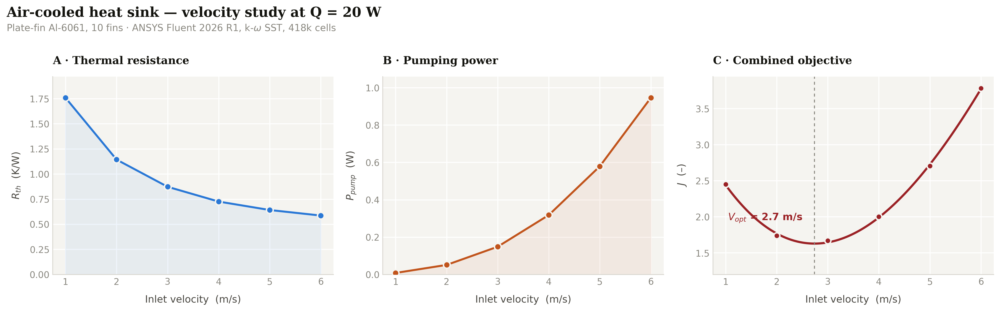
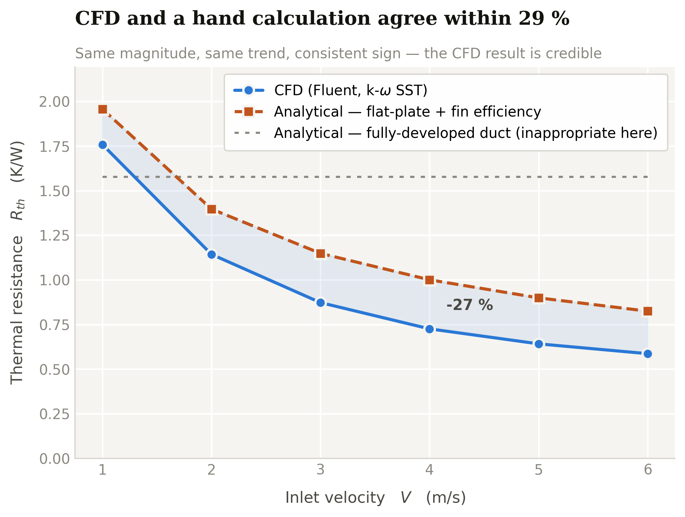

# CFD Analysis and Thermal Performance Optimisation of an Air-Cooled Heat Sink

Steady-state conjugate heat transfer study of a plate-fin aluminium heat sink in
forced convection, run in **ANSYS Fluent 2026 R1**. Inlet velocity is swept from
1 to 6 m/s to find where extra airflow stops paying for itself.



## Case setup

| | |
|---|---|
| Heat sink | 60 × 60 × 3 mm Al-6061 base · 10 fins, 25 mm tall, 1.5 mm thick, 6.2 mm pitch |
| Heat load | 20 W over a central 40 × 40 mm patch (12 500 W/m²) |
| Fluid | Air, 300 K inlet, pressure outlet at 0 Pa gauge |
| Domain | 960 × 260 × 128 mm, modelled as a symmetric half |
| Turbulence | k-ω SST |
| Mesh | 417 997 cells · max skewness 0.81 · min orthogonal quality 0.19 |
| Solver | Pressure-based, steady, SIMPLE, second-order upwind |

## Results

| V (m/s) | T<sub>max</sub> (K) | R<sub>th</sub> (K/W) | Δp (Pa) | P<sub>pump</sub> (W) |
|---:|---:|---:|---:|---:|
| 1 | 335.16 | 1.758 | 0.252 | 0.008 |
| 2 | 322.86 | 1.143 | 0.772 | 0.051 |
| 3 | 317.45 | 0.873 | 1.490 | 0.149 |
| 4 | 314.51 | 0.726 | 2.390 | 0.318 |
| 5 | 312.83 | 0.642 | 3.480 | 0.579 |
| 6 | 311.73 | 0.587 | 4.737 | 0.946 |

Thermal resistance scales as **R<sub>th</sub> ∝ V<sup>−0.62</sup>** while pumping
power scales as **V³**. Going from 1 to 2 m/s buys 14.3 K/W per extra watt of fan
power; going from 5 to 6 m/s buys 0.15 K/W — a hundredfold worse return.

Minimising the normalised objective *J = R/R<sub>ref</sub> + w·P/P<sub>ref</sub>*
puts the balanced optimum at **≈ 2.7 m/s** for equal weighting, moving to 3.2 m/s
if thermal performance is favoured (w = 0.5) and 2.2 m/s if fan power is
expensive (w = 2).

## Validation

**Energy balance.** Heat into the patch 10.000001 W over the half-model; net
imbalance across all external boundaries 2.3 × 10⁻⁵ W — 0.0002 %.

**Analytical model.** A 1-D fin-array model using the laminar flat-plate
correlation Nu<sub>L</sub> = 0.664 Re<sub>L</sub><sup>1/2</sup> Pr<sup>1/3</sup>
with straight-fin efficiency agrees within **10–29 %**, with a consistent sign:
CFD predicts better cooling, as expected from a model that assumes an isothermal
surface and ignores flow acceleration around the array. The fully-developed duct
correlation (Nu = 7.54) is plotted alongside as a counter-example — it predicts
no velocity sensitivity at all, because this heat sink is not in a duct.



## Repository layout

```
notebooks/   Colab notebook — regenerates every figure and CSV
scripts/     standalone Python: plotting style, figures, validation
data/        raw sweep results and derived quantities
figures/     generated plots (PNG; the notebook also emits PDF)
images/      Fluent contour exports at V = 1 and V = 6 m/s
```

## Reproducing

Open `notebooks/Heatsink_CFD_Analysis.ipynb` in Google Colab and run all cells —
each figure cell downloads its own PNG and PDF. Or locally:

```bash
pip install numpy pandas matplotlib
python scripts/plot_results.py
python scripts/validation.py
```

## Limitations

- Single mesh; no formal mesh-independence study (cell count was capped by the
  ANSYS Student licence at 512 k).
- Constant air properties — buoyancy neglected, valid for forced convection.
- Radiation not modelled; at ΔT ≈ 35 K it would contribute a few per cent.
- Minor reversed flow on 1 outlet face (0.1 % of area) at V = 1 m/s.
- Enclosure outer walls treated as adiabatic no-slip, which slightly
  over-constrains the far field.

## License

MIT — see [LICENSE](LICENSE).
