# CFD Analysis and Thermal Performance Optimisation of an Air-Cooled Heat Sink

Steady-state conjugate heat transfer study of a plate-fin aluminium heat sink in
forced convection, solved in **ANSYS Fluent 2026 R1**. Inlet velocity is swept
from 1 to 6 m/s to answer one design question: *at what airflow does extra fan
power stop paying for itself?*

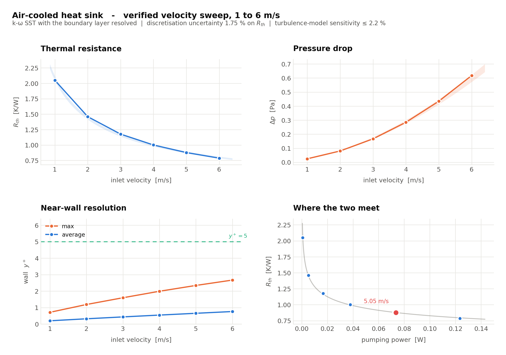

> **Verification status.** Every number below carries a discretisation
> uncertainty from a three-mesh grid-convergence study, a measured y+, and a
> turbulence-model sensitivity check. The headline result is
> **R_th = 0.787 ± 0.014 K/W at 6 m/s**, and the sweep agrees with an
> independent 1-D model to within 5 %. §7 records what was wrong with the first
> version of this study and what it cost — the corrections moved thermal
> resistance by 14–37 % and the optimum velocity from 4.5 to 5.0 m/s.

---

## 1 · Case setup

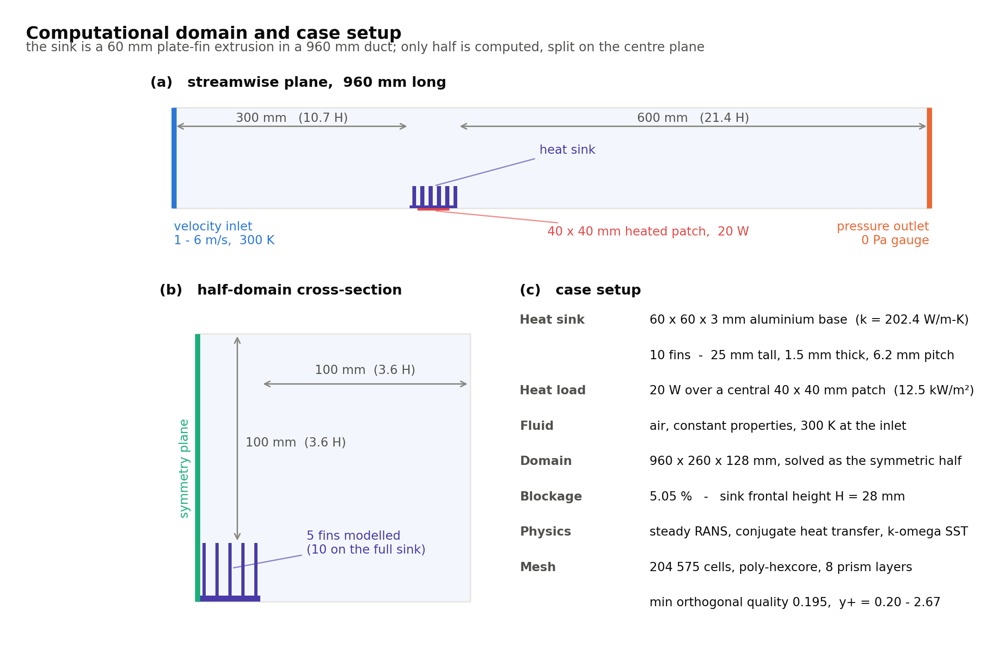

| | |
|---|---|
| Heat sink | 60 × 60 × 3 mm aluminium base · 10 fins, 25 mm tall, 1.5 mm thick, 6.2 mm pitch |
| Solid material | Fluent's built-in `aluminum`, k = 202.4 W/m·K (pure aluminium, not a 6061 alloy — see §8) |
| Heat load | 20 W over a central 40 × 40 mm patch (12 500 W/m²) |
| Fluid | Air, constant properties, 300 K inlet, pressure outlet at 0 Pa gauge |
| Inlet turbulence | 5 % intensity, hydraulic diameter 0.129 m |
| Domain | 960 × 260 × 128 mm; the **960 × 130 × 128 mm symmetric half** is solved |
| Physics | Steady RANS · conjugate heat transfer, solid and fluid solved together |
| Turbulence | k-ω SST, `correlation` near-wall treatment, production limiter on, Low-Re corrections off |
| Mesh | 204 575 cells · poly-hexcore · **8 prism layers on every wetted wall** · min orthogonal quality 0.195 |
| Solver | Pressure-based, SIMPLE, second-order upwind for momentum, energy, k and ω; warped-face gradient correction on |

<p align="center">
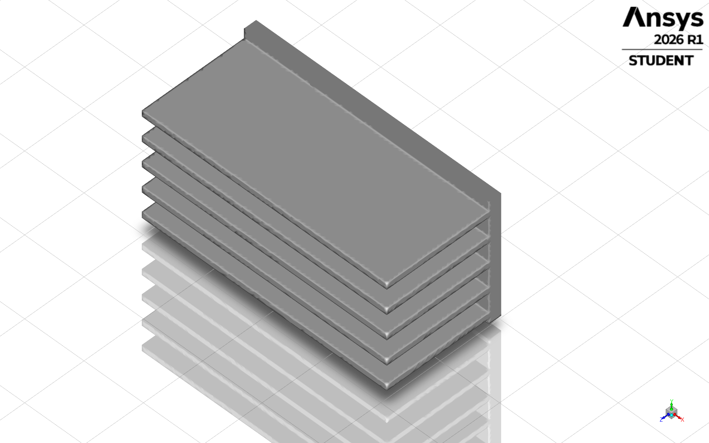
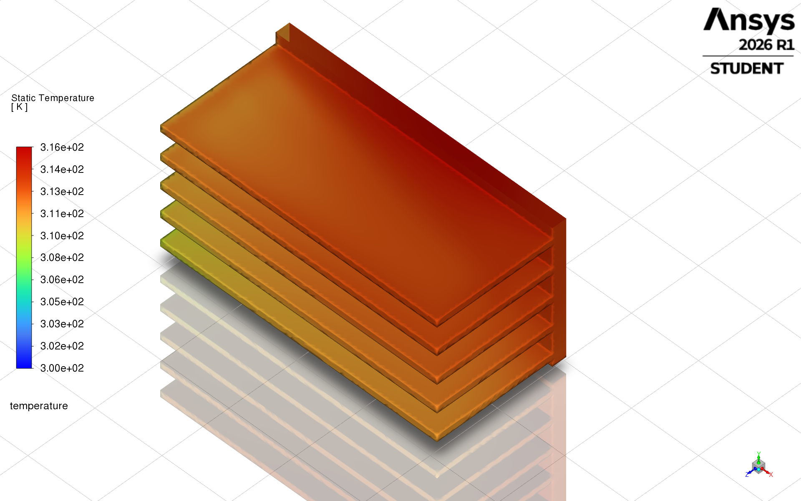
</p>

The symmetric half carries **5 of the 10 fins**; the symmetry plane falls in the
gap between the two central fins, so no fin is cut. The heated patch is a
40 × 20 mm strip of the base underside lying against the symmetry plane — half
of the 40 × 40 mm device footprint.

### Domain sizing

The outer boundaries have to be far enough away that they are not shaping the
answer. Measured against the frontal height of the sink, H = 28 mm:

| Metric | This model | Usual external-flow guideline | |
|---|---:|---|---|
| Blockage ratio | 5.05 % | a few per cent | at the edge |
| Upstream | 10.7 H | ≥ 5 H | comfortable |
| Downstream | 21.4 H | ≥ 10–15 H | comfortable |
| Side and top clearance | 3.6 H | ≥ 5 H | **below guideline** |

The downstream length is deliberately twice the upstream length so the wake
dissipates before it reaches the pressure outlet. The lateral clearance is the
one dimension that falls short, and no domain-independence study was run to
show it does not matter. It remains the largest untested modelling choice.

Reproduce this table with `python scripts/flow_regime.py`.

### Why k-ω SST

The channel Reynolds number, on the hydraulic diameter of a fin channel wetted
on three sides (D_h = 8.59 mm — the channel is open at the top, which is what
makes this an unducted sink):

| V (m/s) | 1 | 2 | 3 | 4 | 5 | 6 |
|---|---:|---:|---:|---:|---:|---:|
| Re_Dh | 588 | 1 176 | 1 765 | 2 353 | 2 941 | 3 529 |
| Regime | laminar | laminar | laminar | transitional | transitional | transitional |

The sweep straddles the laminar-to-transitional boundary, so the model has to
stay valid at low Reynolds number near the wall rather than assume a
fully-developed turbulent boundary layer. That rules out standard k-ε with wall
functions and points to k-ω SST, which integrates to the wall in the near-wall
region and blends to k-ε in the freestream.

**That argument is qualitative, so §6 tests it quantitatively** by re-solving
the two end points with the four-equation Transition SST model.

---

## 2 · Results

| V (m/s) | T_max (K) | R_th (K/W) | Δp (Pa) | P_pump (W) | y+ avg | y+ max |
|---:|---:|---:|---:|---:|---:|---:|
| 1 | 341.00 | 2.050 | 0.0248 | 0.00083 | 0.20 | 0.71 |
| 2 | 329.20 | 1.460 | 0.0805 | 0.00536 | 0.32 | 1.18 |
| 3 | 323.54 | 1.177 | 0.1669 | 0.01666 | 0.43 | 1.60 |
| 4 | 320.01 | 1.000 | 0.2849 | 0.03792 | 0.54 | 1.99 |
| 5 | 317.55 | 0.878 | 0.4349 | 0.07236 | 0.65 | 2.34 |
| 6 | 315.74 | 0.787 | 0.6180 | 0.12339 | 0.76 | 2.67 |

<p align="center">
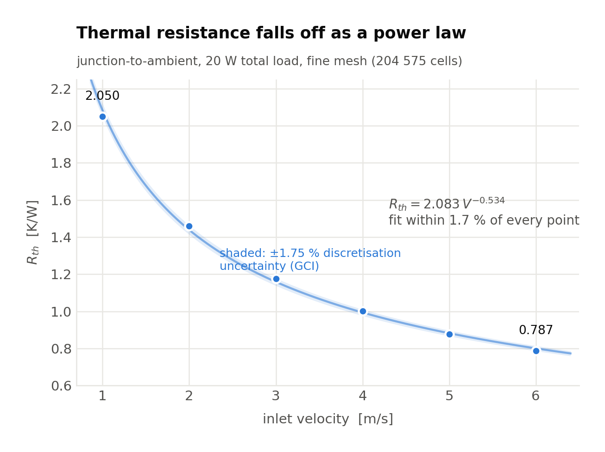
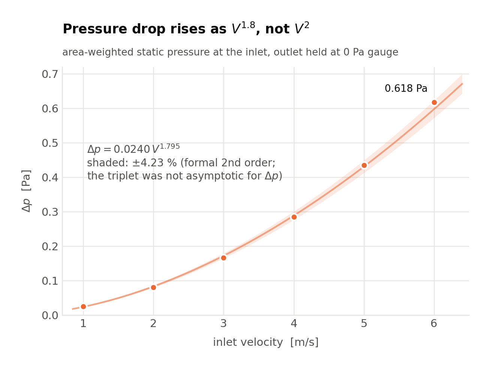
</p>

Fitted over the swept range, with the maximum deviation of the fit from any
single point:

$$R_{th} = 2.083\,V^{-0.534}\ (1.7\%) \qquad
\Delta p = 0.0240\,V^{1.795}\ (3.3\%) \qquad
P_{pump} = 0.000798\,V^{2.795}$$

The pressure-drop exponent is worth a sentence, because the reflex expectation
is Δp ∝ V². **It is not V² here, and it should not be.** V² is the
inertia-dominated, fully-turbulent result; fully-developed laminar channel flow
gives V¹. At Re_Dh between 588 and 3 529 this flow is in neither regime, and an
exponent of 1.80 is where a laminar-to-transitional channel with a short
entrance length belongs.

A 6× increase in airflow buys a **62 % reduction in thermal resistance** and
costs **150× more pumping power**.

---

## 3 · The trade-off, and how firm the optimum is

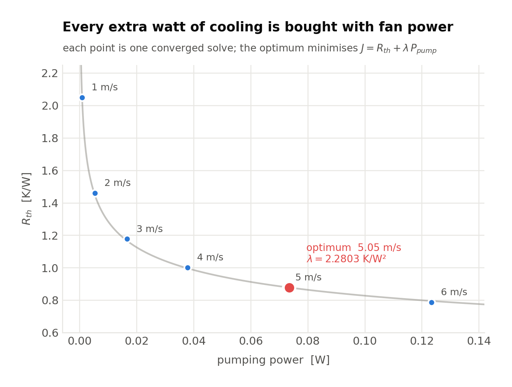

The marginal return — thermal resistance bought per extra watt of fan power —
collapses across the sweep:

| Step (m/s) | 1→2 | 2→3 | 3→4 | 4→5 | 5→6 |
|---|---:|---:|---:|---:|---:|
| K/W per extra W | 130.1 | 25.1 | 8.3 | 3.6 | 1.8 |

That is a 73-fold collapse, and it needs no objective function, no weighting
and no normalisation to read. A designer who can say what a watt of fan power
is worth to them can pick their operating point off that row directly.

### The optimum, stated so that one number carries the judgement

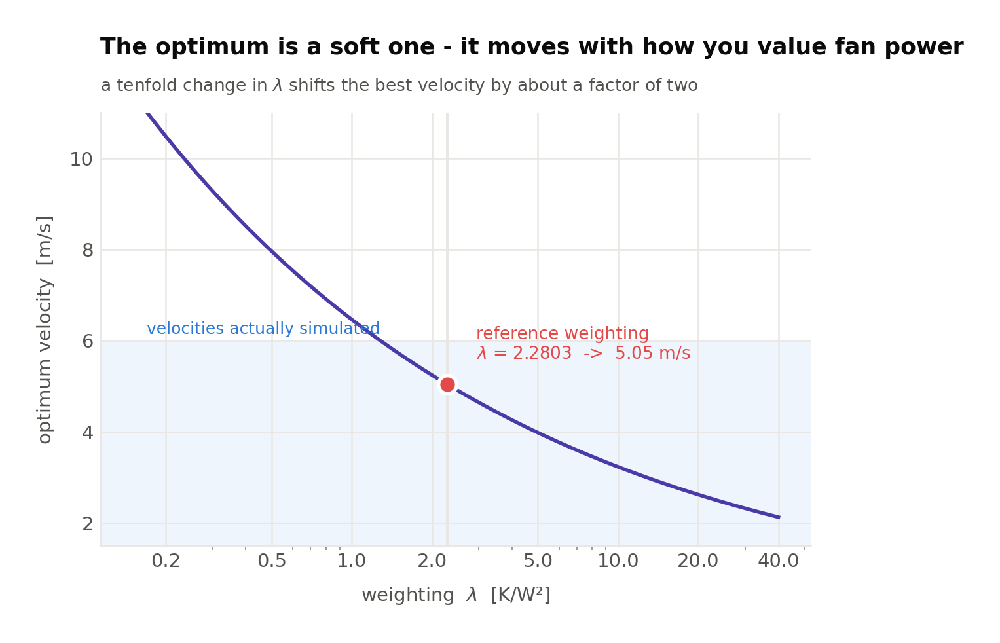

An earlier version of this analysis minimised a normalised objective
*J = R/R_ref + w·P/P_ref*. That form has two knobs — the weight *w* and the
reference point — setting a single exchange rate, and the reference point is a
normalisation with no physics in it. Collapsing them leaves one parameter that
carries units and meaning:

$$J(V) = R_{th}(V) + \lambda\,P_{pump}(V), \qquad \lambda \ \text{in K/W}^2$$

λ is the only judgement left: what a watt of fan power is worth. With both
quantities following power laws the minimum is closed-form — no curve fit and
no grid search:

$$V_{opt} = \left[\frac{-a\,p}{\lambda\,b\,q}\right]^{1/(q-p)} \propto \lambda^{-0.30}$$

λ = 2.2803 K/W² is a **declared reference value carried over from the first
version for continuity, not a measured or derived one** — no file in this
repository establishes it, and it stands in for a designer's judgement. For
scale: the first version's reported optimum of 2.74 m/s corresponds to
λ ≈ 12.8 K/W² on that version's own data, so the two studies differ in the
*valuation* as much as in the physics. That is exactly why the table below
matters more than the single number.

| λ (K/W²) | 0.25 | 0.5 | 1 | **2.28** | 5 | 10 | 25 |
|---|---:|---:|---:|---:|---:|---:|---:|
| V_opt (m/s) | 9.80 | 7.96 | 6.46 | **5.05** | 3.99 | 3.24 | 2.46 |

**Reported result: 5.0 m/s at λ = 2.28 K/W², within a 3.2–6.5 m/s band for λ
anywhere between 1 and 10 K/W².** The exponent is the useful part: a 100-fold
disagreement about the value of a watt moves the optimum by a factor of four, so
the optimum is soft and should be quoted as a band, not to two decimals.

---

## 4 · Verification

Verification asks whether the equations were solved correctly; §6 asks whether
they were the right equations.

| Check | Status | Result |
|---|---|---|
| Heat input | ✅ | 10.000044 W into the half-model against a 10 W target — 4 ppm |
| Iterative convergence | ✅ | last-30-iteration standard deviation ≤ 0.006 K on T_max, ≤ 6 × 10⁻⁴ Pa on Δp |
| Reproducibility | ✅ | 6 m/s re-solved from the saved case: 0.0003 K and 0.05 % from the first run |
| Near-wall resolution (y+) | ✅ | measured, 0.20–2.67 across the whole sweep |
| Grid convergence (GCI) | ✅ | three meshes, 76 k / 123 k / 205 k cells |

**Two 6 m/s numbers appear in this README, and the difference is deliberate.**
The sweep in §2 reports the original solve (T_max 315.7402 K, Δp 0.617963 Pa).
The grid-convergence triplet in this section and the model comparison in §6
report the *re-solve* of the same case (315.73992 K, 0.617657 Pa), so that the
three meshes and the 6 m/s turbulence-model comparison all come from one solver
session. (The 1 m/s k-ω SST column in §6 is the original sweep solve; that case
was not re-run.) The two differ by 0.0003 K and 0.05 %, which is the
reproducibility figure in the table above.

### Near-wall resolution

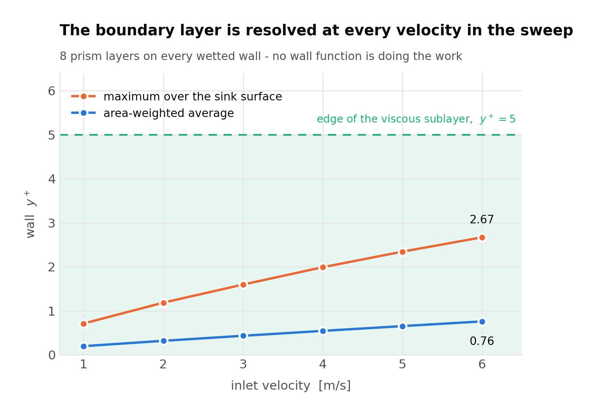

<p align="center">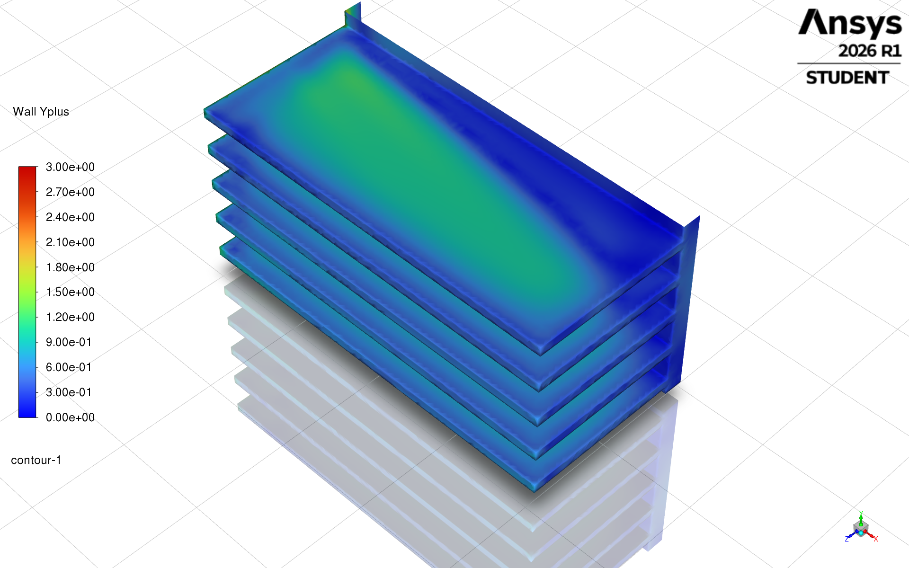</p>

k-ω SST was chosen for its ability to integrate to the wall, and that property
is governed by y+. The mesh carries **8 prism layers** on every wetted wall,
built with the `last-ratio` offset method so the stack fits inside a 4.7 mm
channel without colliding with the stack growing off the facing fin. Measured
y+ stays inside the viscous sublayer everywhere: **maximum 2.67 at 6 m/s**,
area-weighted average 0.76. No wall function is doing the work.

### Grid convergence

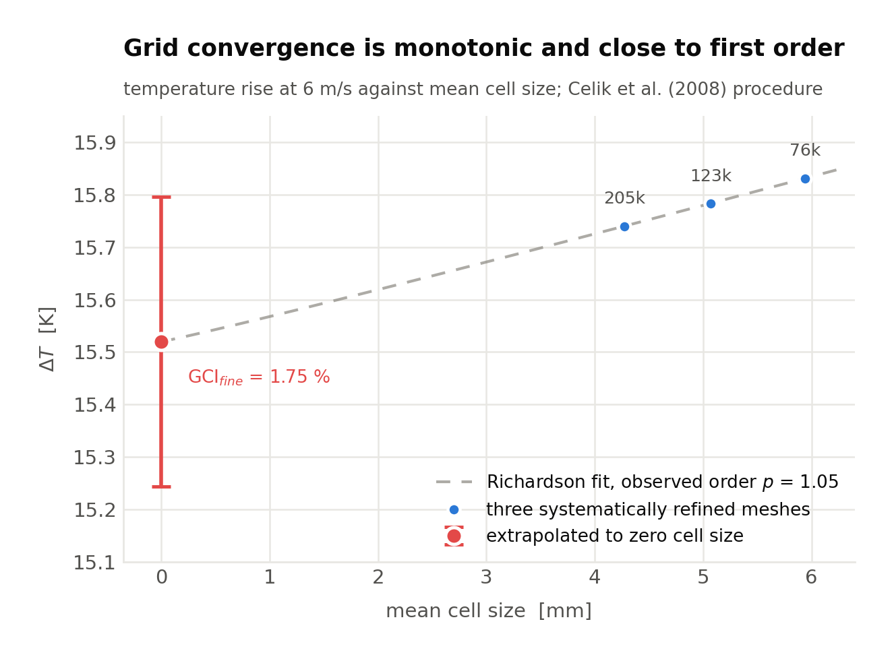

Three systematically refined poly-hexcore meshes, all solved at 6 m/s, analysed
with the procedure of **Celik et al. (2008)** (ASME J. Fluids Eng. 130(7)):

| Mesh | Cells | Mean cell size | Min orthogonal quality | ΔT (K) | Δp (Pa) | y+ max |
|---|---:|---:|---:|---:|---:|---:|
| coarse | 76 186 | 5.94 mm | 0.195 | 15.831 | 0.6328 | 4.06 |
| medium | 122 656 | 5.07 mm | 0.197 | 15.783 | 0.6261 | 3.26 |
| fine | 204 575 | 4.27 mm | 0.195 | 15.740 | 0.6177 | 2.67 |

r₂₁ = 1.186, r₃₂ = 1.172.

**Thermal resistance converges cleanly.** ε₃₂/ε₂₁ = 1.11 > 1, so the refinement
is monotonically convergent; the observed order is **p = 1.05**, Richardson
extrapolation gives ΔT → 15.52 K, and

$$\mathrm{GCI}_{fine} = 1.75\,\% \quad\Longrightarrow\quad R_{th} = 0.787 \pm 0.014\ \mathrm{K/W}$$

**Pressure drop does not, and that is reported rather than hidden.**
ε₃₂/ε₂₁ = 0.79 < 1: the successive differences *grow* with refinement, so the
three grids are not in the asymptotic range and no observed order can be
extracted. The cause is identifiable rather than mysterious — the prism
first-layer height was chosen per mesh to keep y+ sensible (y+max 4.06 / 3.26 /
2.67) instead of being scaled by the refinement ratio, so near-wall resolution
did not refine systematically. Δp is dominated by wall shear and inherits that;
ΔT is not, and converges. Reported conservatively at the formal second order of
the scheme:

$$\Delta p = 0.618 \pm 0.026\ \mathrm{Pa} \quad (\mathrm{GCI} = 4.2\,\%)$$

The practical fine↔medium difference is 1.4 %, so the engineering answer is not
in question; what is missing is the formal demonstration, and closing it would
need a fourth mesh with the prism stack scaled by r.

Two further caveats are stated rather than buried: r ≈ 1.18 is below the 1.3
refinement ratio Celik recommends (prism cells scale with surface area, not
volume, so a uniform volume refinement cannot reach 1.3 inside the 512 k-cell
licence cap), and the solver-side separation of the heated patch resolves its
area to 802.4 / 797.2 / 811.5 mm² on the three meshes against a nominal
800.0 mm² (+0.3 %, −0.3 %, +1.4 %). The applied flux was adjusted on each mesh
so that exactly 10 W enters regardless.

Reproduce the whole analysis, including a self-test against the worked example
in the Celik paper:

```bash
python scripts/gci.py --selftest    # reproduces Celik Table 1: p = 1.53, GCI = 2.17 %
python scripts/gci.py
```

---

## 5 · Validation

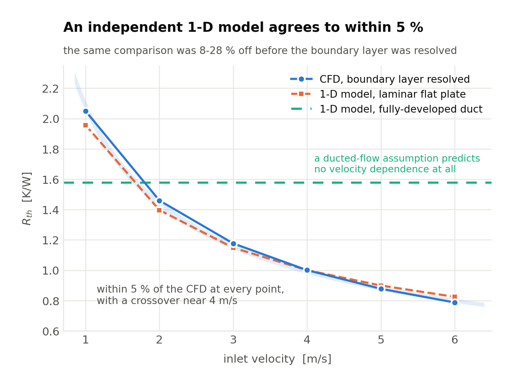

A 1-D fin-array model built from the laminar flat-plate correlation
Nu_L = 0.664·Re_L^½·Pr^⅓ with straight-fin efficiency and base conduction agrees
with the CFD to within **5 % at every velocity**:

| V (m/s) | 1 | 2 | 3 | 4 | 5 | 6 |
|---|---:|---:|---:|---:|---:|---:|
| R_th, 1-D model (K/W) | 1.957 | 1.397 | 1.148 | 1.000 | 0.899 | 0.825 |
| R_th, CFD (K/W) | 2.050 | 1.460 | 1.177 | 1.000 | 0.878 | 0.787 |
| deviation | +4.7 % | +4.5 % | +2.5 % | +0.0 % | −2.4 % | −4.6 % |

The two curves cross near 4 m/s, and the sign of the disagreement is the
expected one on each side. Below 4 m/s the boundary layers growing off facing
fins **merge before the trailing edge** (δ/half-gap = 1.99 at 1 m/s, 1.00 at
4 m/s), so the flat-plate picture over-predicts the heat transfer coefficient;
above 4 m/s each fin wall is still a free flat plate at the trailing edge and
the 1-D model, which assumes an isothermal surface and ignores acceleration
around the array, under-predicts R_th slightly. The velocity exponents agree
too: **−0.53 (CFD) against −0.48 (model)**.

The counter-example is kept because it is the sharper argument: the
fully-developed duct correlation (Nu = 7.54) predicts R_th ∝ V⁰ — **no velocity
sensitivity at all**. The CFD shows a strong velocity dependence, so whatever
else is true, this heat sink is not behaving as a closed duct. A correlation
that predicts the wrong *trend* is disqualified regardless of its constant.

```bash
python scripts/validation.py
```

---

## 6 · Model-form sensitivity: is "fully turbulent" the right assumption?

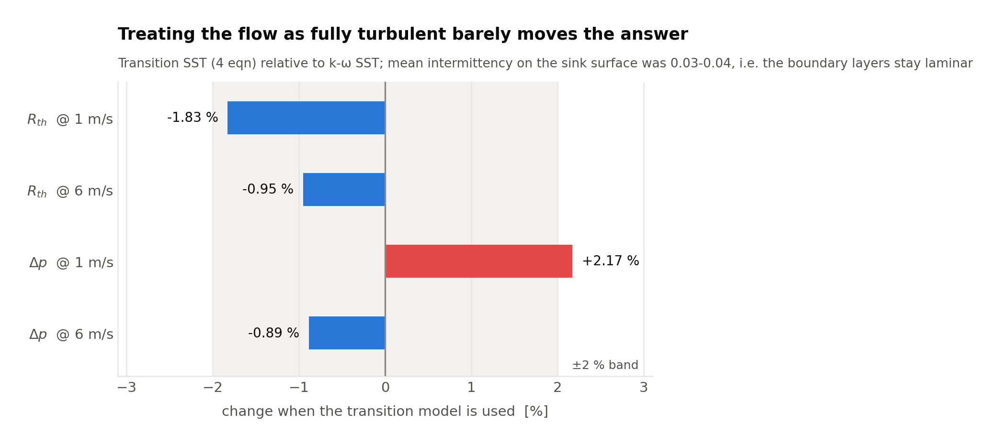

k-ω SST solves the boundary layers as fully turbulent. At Re_Dh = 588–3 529 that
is an assumption, not a fact, so both end points of the sweep were re-solved
with the four-equation **Transition SST (γ–Re_θ)** model. Only the transition
treatment was changed: Fluent enables the Kato-Launder production limiter by
default when that model is selected, and it was switched back off so the
comparison isolates one variable.

| | SST @ 1 m/s | Transition @ 1 m/s | SST @ 6 m/s | Transition @ 6 m/s |
|---|---:|---:|---:|---:|
| R_th (K/W) | 2.050 | 2.012 | 0.787 | 0.779 |
| **change** | | **−1.83 %** | | **−0.95 %** |
| Δp (Pa) | 0.0248 | 0.0253 | 0.6177 | 0.6122 |
| **change** | | **+2.17 %** | | **−0.89 %** |
| mean intermittency on the sink | — | 0.034 | — | 0.044 |

<p align="center">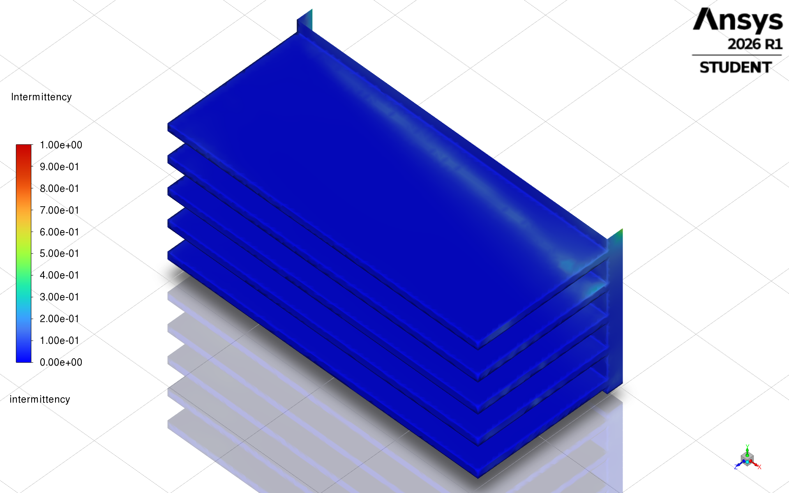</p>

The intermittency is the interesting part. γ ≈ 0.03–0.04 means the transition
model says the boundary layers on the fins stay **essentially laminar** and
never transition. Yet both engineering quantities move by under 2.2 %.

Two effects cancel. A laminar boundary layer has a lower local heat transfer
coefficient (worse), but it also has lower skin friction, so more air passes
through the fin channels instead of bypassing over the top of this unducted
sink (better). The pressure drop, which depends on friction alone, shows the
friction half of that story directly.

**So the fully-turbulent assumption does not materially bias the answer for
this geometry at these velocities — and that is now a measured statement rather
than an argument from Reynolds number.** Two independent uncertainty figures
now sit on the result: **1.75 % discretisation** and **≈ 2 % model form**.

---

## 7 · What changed since the first version, and what it cost

The first version of this study reported a velocity sweep on a tetrahedral mesh
of 417 997 cells (its own README's figure), with **no inflation layers**, an
unmeasured y+, no grid-convergence study and no model-sensitivity check.
Rebuilding it exposed three faults, in ascending order of how much they
mattered.

**1 · The geometry had a defect that had silently blocked meshing for weeks.**
Share-topology, body merging and the tetrahedral fill had all been failing on
the assembly, with 7 659 self-intersecting faces reported at a repeating
coordinate. The cause was found by measuring between the bodies: the five fin
solids sat at **0.05°–0.07° to the base**, opening a wedge gap that ran from
zero to 73 µm along each fin root. Every downstream failure followed from that.
Rebuilding the fins as pulled features on the base body instead of separate
solids produced a watertight assembly that Fluent meshed in five seconds —
2 fluid/solid regions, 0 voids, 0 marked faces.

**2 · Without prism layers, the near-wall gradients were unresolved, and the
error was systematic.** The corrected geometry accepted 8 prism layers, and the
whole sweep was re-run. Thermal resistance rose by **14–37 %** and pressure drop
fell by **14–21 %**, both in the direction an under-resolved boundary layer
predicts: too much wall heat transfer, too little wall shear.

| V (m/s) | 1 | 2 | 3 | 4 | 5 | 6 |
|---|---:|---:|---:|---:|---:|---:|
| R_th, no prism layers (K/W) | 1.794 | 1.155 | 0.880 | 0.732 | 0.650 | 0.596 |
| R_th, 8 prism layers (K/W) | 2.050 | 1.460 | 1.177 | 1.000 | 0.878 | 0.787 |
| change | +14 % | +26 % | +34 % | +37 % | +35 % | +32 % |

The velocity exponent moved from −0.62 to −0.53, and the optimum from **4.5 to
5.0 m/s** (both at λ = 2.28 K/W²; the first version quoted 2.7 m/s, but from a
different objective function as well as different data, so the two figures are
not a like-for-like comparison). The agreement with the independent 1-D model,
which had been 8–28 % with a consistent one-sided bias, tightened to **±5 % with
a physically explicable crossover** — an independent confirmation that the
corrected result is the better one, not merely the newer one.

**3 · Nothing carried an uncertainty.** The grid-convergence study, the y+
measurement and the transition-model comparison in §4 and §6 are all new.

Detail and dates: [`docs/change_log.md`](docs/change_log.md).

---

## 8 · Limitations

Ordered by how much they could move the answer.

1. **Side and top clearance is 3.6 H**, below the 5 H external-flow guideline,
   with no domain-independence check. This is now the largest untested choice.
2. **Pressure drop has no formal grid-independence demonstration.** The three
   meshes are not in the asymptotic range for Δp (§4); the reported ±4.2 % is a
   conservative bound at the scheme's formal order, not an observed one.
3. **The refinement ratio is 1.18**, below the 1.3 Celik recommends, because
   prism cells scale with surface area rather than volume and the student
   licence caps the cell count at 512 k.
4. **Radiation not modelled.** At ΔT ≈ 16–41 K it would contribute a few per
   cent of the total heat transfer — the same order as the numerical
   uncertainties above, and neglected without a calculation to justify it.
5. **Constant air properties, buoyancy neglected.** Defensible for forced
   convection at these velocities, but unquantified at 1 m/s, where the
   buoyancy contribution is largest.
6. **The global energy imbalance was not re-exported on the final mesh.** Heat
   *input* is verified to 4 ppm; the closing balance over all boundaries was
   recorded for the first version only.
7. **Min orthogonal quality is 0.195–0.197**, at the edge of the usual
   acceptable band, on all three meshes.
8. **The transition-model check covers only the two end velocities**, 1 and
   6 m/s, and only on the fine mesh.
9. **The solid is modelled as pure aluminium** (Fluent's built-in `aluminum`,
   k = 202.4 W/m·K). A 6061-T6 extrusion is nearer 167 W/m·K, which would raise
   the conduction share of R_th slightly; the sink is convection-limited
   rather than conduction-limited here (fin efficiency 0.95–0.98 across the
   sweep, and base conduction is 0.2–0.5 % of R_th), so the effect is small —
   but it was not quantified in the CFD.
10. **No experimental validation.** The 1-D model is an independent check, not a
   measurement.
11. **Fin geometry was fixed, not optimised.** Pitch, thickness and height were
    chosen as a representative commercial design for a 20 W load; the swept
    variable is velocity alone.

---

## 9 · Repository layout

```
README.md
docs/
  change_log.md        what was wrong in the first version, how it was found,
what it cost
  ansys_setup.md       every solver setting needed to reproduce the runs
scripts/
  make_figures.py      regenerates all 11 figures from inline data (Colab-ready)
  gci.py               grid convergence index, with a self-test against Celik (2008)
  validation.py        1-D fin-array model and the correlation-choice check
  flow_regime.py       domain metrics, Reynolds regime, boundary-layer development
data/
  velocity_sweep.csv                 the reported sweep, with convergence
standard deviations and y+
  grid_convergence.csv               the three-mesh triplet
  turbulence_model_sensitivity.csv   SST vs Transition SST at 1 and 6 m/s
  validation.csv                     1-D model against CFD
  power_law_fits.csv                 fitted exponents and fit error
  optimum_vs_lambda.csv              optimum velocity against the weighting
  marginal_return.csv                K/W bought per extra watt of fan power
  flow_regime.csv, domain_metrics.csv, boundary_layer.csv, near_wall_sizing.csv,
  inflation_spec.csv, inflation_feasible.csv
  velocity_sweep_v1_unresolved.csv   the superseded sweep, kept for §7
figures/   the 11 generated plots (PNG and SVG)
images/    Fluent exports: geometry, surface temperature, y+, intermittency
```

## 10 · Reproducing

Everything that does not need a solver runs from the repository:

```bash
pip install numpy pandas matplotlib

python scripts/gci.py --selftest    # verify the GCI implementation first
python scripts/gci.py               # grid convergence study
python scripts/validation.py        # analytical cross-check
python scripts/flow_regime.py       # domain, regime, boundary-layer development
python scripts/make_figures.py      # all 11 figures into figures/
```

`scripts/make_figures.py` carries its own data inline and runs unchanged in
Google Colab. The Fluent side is documented step by step in
[`docs/ansys_setup.md`](docs/ansys_setup.md).

## License

MIT — see [LICENSE](LICENSE).
